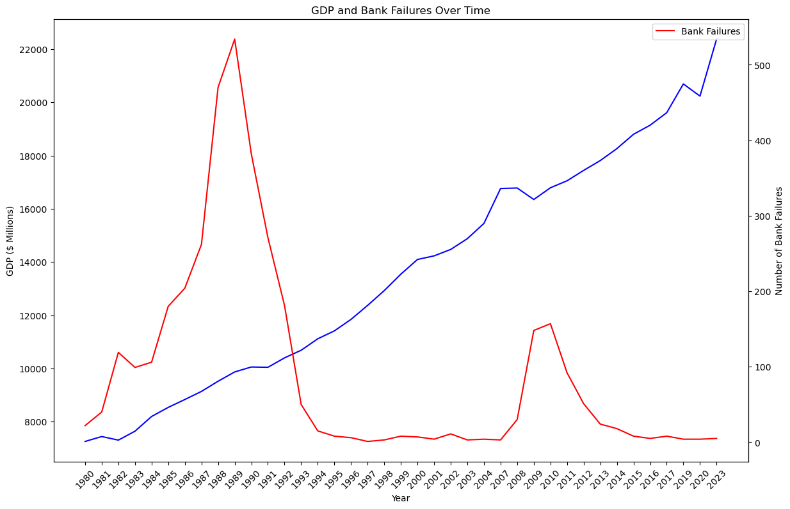

# Bank-Failures

This project consists of real data from the FDIC, showing banks that failed from 1980 to 2023. It was inspired by the failure of Silicon Valley Bank last year. The bank failed due to not anticipating the effect of locking its depositors' money into relatively low-interest-rate securities.

The tools I used for this project are Python and SQLite, along with some additional Python packages for visualizations, but mainly SQLite to showcase my SQL experience.

So far, we have answered a few questions about this data:

1. **How many banks have failed in this dataset?**
   - We found that a total of 3,548 banks have failed.

2. **What are the unique locations where banks have failed?**
   - We found that there are 1,998 unique cities that had bank failures. Out of these unique locations, there were 53 unique states.

3. **What are the top 10 states with bank failures?**
   - We found that Texas had almost a fourth of the bank failures by calculating the cumulative percentage. Here is a visual of the top 10 states:
   - 

### Exploratory Data Analysis (EDA) Summary

**Objective**: Understand patterns and trends in bank failures over time and their relationship with GDP.

#### Data Overview:
- **Time Period**: 1980 to 2023
- **Key Variables**:
  - **GDP_DATE**: Year of GDP data
  - **value**: Annual GDP value in millions of dollars
  - **BANK_FAILURES**: Number of bank failures in a given year

#### Key Findings:
- **Trend Analysis**: Bank failures fluctuate significantly, peaking during economic downturns.
- **Descriptive Statistics**: 
  - Average number of bank failures per year provides insights into typical failure rates.
  - GDP values show an overall increasing trend, reflecting economic growth.
- **Top Years for Bank Failures**:
  - **Highest Number of Failures**: 1989 with 534 failures.
  - **Significant Increases**: Late 1980s, early 1990s, and the 2008 financial crisis.
- **Geographical Analysis**: States with the highest number of failures identified, highlighting regional vulnerabilities.
- **Correlation Analysis**: Initial analysis shows a negative correlation between GDP and bank failures.

#### Visualizations:
- **Time Series Plot**: Trends in GDP and bank failures over time.
  - 

#### Summary of Insights:
- **Economic Impact**: Bank failures are influenced by broader economic conditions.
- **Significant Periods**: Late 1980s, early 1990s, and 2008 financial crisis had high failure rates.
- **Regional Vulnerabilities**: Certain states have higher failure rates.

#### Recommendations for Further Analysis:
- **Incorporate Additional Economic Indicators**: Unemployment rates, interest rates, and inflation.
- **Advanced Modeling**: Time series and regression models to predict bank failures.
- **Explore External Factors**: Regulatory changes and their impact on bank failures.

This is an ongoing project and will be updated with more queries.

